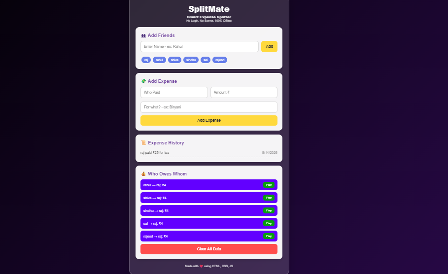

# SplitMate - Smart Expense Splitter

`No Login. No Server. 100% Offline`

SplitMate is a simple web app to split expenses with friends. Add who spent what, and it automatically calculates who owes whom. All data is saved locally in your browser.

## ✨ Features
1. **100% Offline** - Works without internet. No data goes to any server
2. **No Login Required** - Open and start using instantly
3. **Smart Split Calculation** - Handles any number of people in the group
4. **UPI Pay Button** - Pay directly using UPI with one click
5. **Mobile Responsive** - Works perfectly on phone and desktop

## 🛠️ Tech Stack
`HTML` `CSS` `JavaScript` - Built with Vanilla JS. No frameworks.

## 🚀 Live Demo
https://your-username.github.io/splitmate  
*Note: Replace with your GitHub Pages link*

## 💻 Run Locally
1. Clone or download this repo
2. Open `index.html` in your browser
3. That's it!

## ⚙️ How to add your UPI ID
Open `script.js` and replace `yourupi@upi` with your UPI ID.  
Example: `name@upi`

## 📸 Screenshot
  
*Note: Upload a screenshot to your repo and update the name*
splitmate/
│
├── README.md         
├── Splitmate_UI.png           
├── index.html           
├── scripts.js         
└──  style.css   

     
## 👨‍💻 About Me
**Parthiban**  
Aspiring Data Scientist & Data Analyst | Python | Machine Learning | Streamlit| Web Dev

📍 Thanjavur, Tamil Nadu, India

Passionate about building data-driven solutions and deploying ML models into real-world applications. 
I enjoy creating tools that are simple , offline-first and useful for everyone.

This project was built to strengthen my skills in HTML,CSS Javascript and Product Thinking.

[[GitHub](https://github.com/)](https://github.com/parthiban-data/splitmate.git)|[Live Demo]( https://parthiban-data.github.io/splitmate/)

If you liked this project, please give it a ⭐

---
Made with ❤️ for friends
